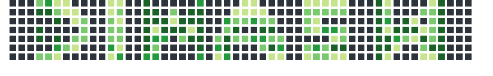

&nbsp;
# 👨🏻‍💻  About Me
🧒🏻 &nbsp;My name is Dimas Wahyu Saputro and I'm studying to become a Full Stack Data\
🎓 &nbsp;I'm currently in the fifth semester of Data Science at Sumatera Institute of Technology.\
🎵 &nbsp;In my free time, I enjoy listening to music\
✉️ &nbsp;You can shoot me an email at dim.mas.ws@gmail.com and I'll try to respond as soon as I can.

&nbsp;

# 🛠️ Tech Stack

&nbsp;
# 📊 Github stats  

 
  
GitHub Profile Stats 💻

   
    
  
   

  
Activity Graph 📈

   

  
Profile Views 👁️

   
  

